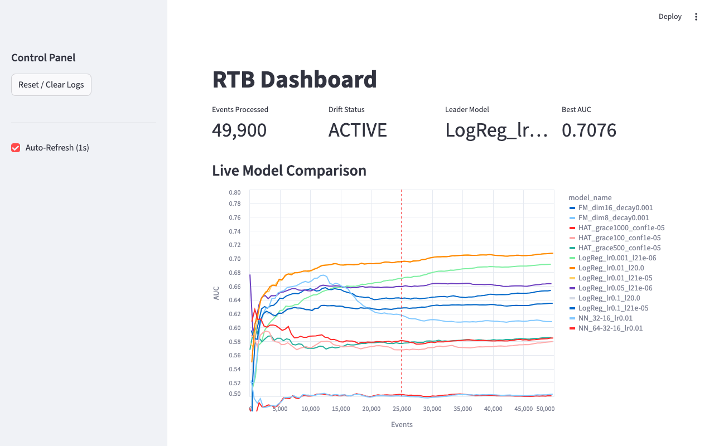
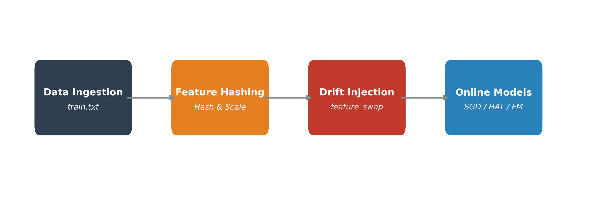

# Real-Time Bidding: CTR Prediction with Online Learning

A streaming ML pipeline for click-through rate prediction in real-time bidding. Uses online learning to update model weights after every bid request instead of batch retraining, which keeps the model fresh as user behavior changes.

**Stack:** Python, River (Hoeffding Trees, Factorization Machines), PyTorch (SGD Neural Net), Streamlit, Altair

## Overview

This project processes continuous streams of advertising data using the Criteo Display Advertising Dataset, simulating an RTB environment locally with 50,000+ events in a single pass.

Three model families are compared:
- Online linear models (Logistic Regression via River)
- Adaptive trees (Hoeffding Adaptive Trees via River)
- Neural networks (PyTorch MLP with single-sample SGD)

## Dashboard

The Streamlit dashboard visualizes live performance across 50,000 events, including throughput, AUC, and drift detection status:



## Architecture



The system is built as a modular Python pipeline:
- Online learning via the River library (Hoeffding Adaptive Trees, Factorization Machines)
- Deep learning with a custom PyTorch MLP using single-sample SGD
- Data streaming through chunked Pandas ingestion for datasets larger than RAM (11GB+)
- Monitoring with real-time Streamlit + Altair visualizations

## Implementation Details

### Feature Hashing
Recent River updates (v0.21+) introduced breaking changes to mixed-type feature scaling. To work around this, a custom `RobustHasher` maps high-cardinality string features into a fixed sparse numeric space using Python's native hashing, removing the dependency on unstable APIs.

### Concept Drift Testing
A drift injection module triggers a "feature swap" at Event 25,000, simulating a corrupted data feed. The dashboard captures the immediate AUC drop and subsequent model recovery as it adapts to the new schema.

## Benchmarks

Single-pass training on 50,000 events from the Criteo dataset:

| Metric | Result |
| --- | --- |
| Best Model | Logistic Regression (SGD, L2=1e-06) |
| Final AUC | 0.7067 |
| Throughput | ~29 events/sec (CPU) |

The linear baseline provided the best convergence speed vs. accuracy trade-off for this data slice.

## Setup & Usage

**Prerequisite:** Requires the Criteo dataset (excluded due to size — 11GB).

1. Download `train.txt` from [Kaggle](https://www.kaggle.com/datasets/mrkmakr/criteo-dataset) and place it at `data/raw/train.txt`.

2. Install dependencies:
```bash
pip install -r requirements.txt
```

3. Run the pipeline:
```bash
python main.py pipeline
```

4. Launch the dashboard (separate terminal):
```bash
python main.py ui
```

---

Requires Python 3.11.

**Citation:** Criteo Labs. (2014). Kaggle Display Advertising Challenge Dataset. [https://www.kaggle.com/datasets/mrkmakr/criteo-dataset](https://www.kaggle.com/datasets/mrkmakr/criteo-dataset)
